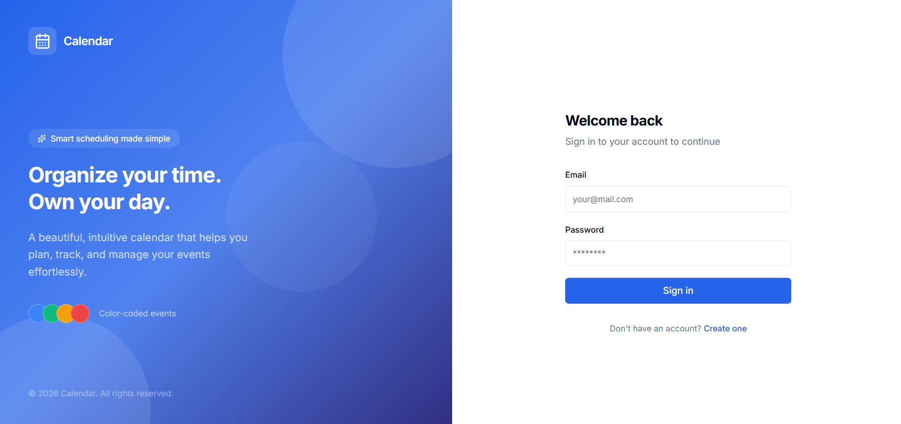
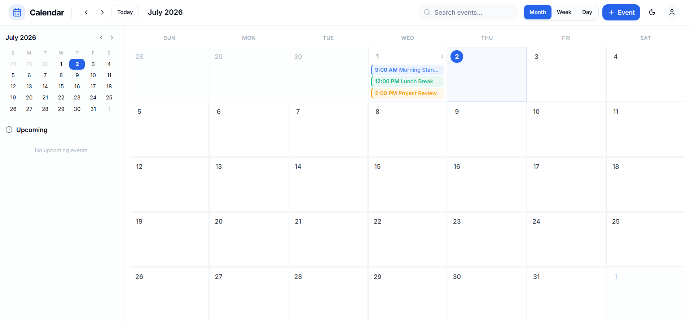
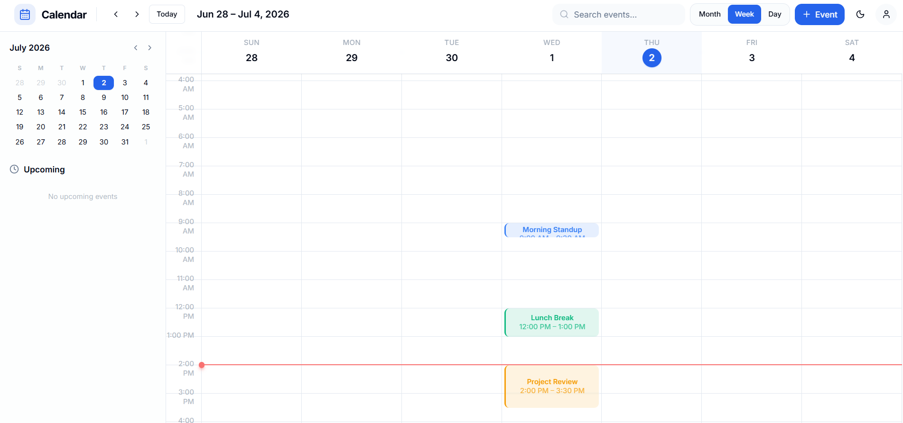
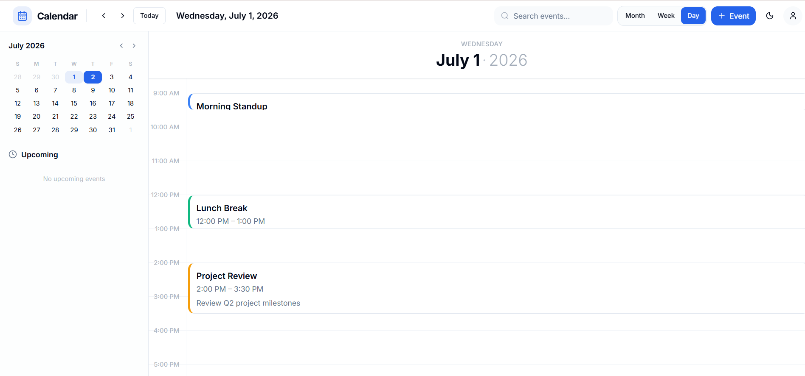
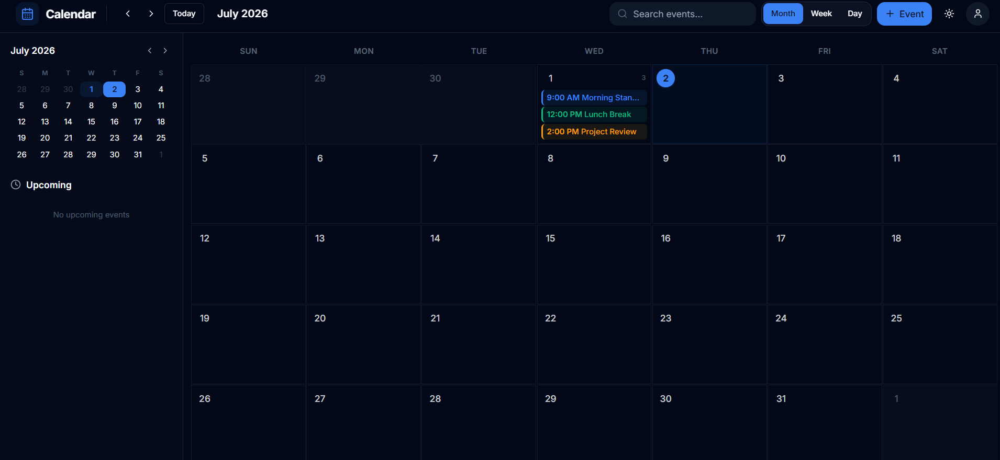
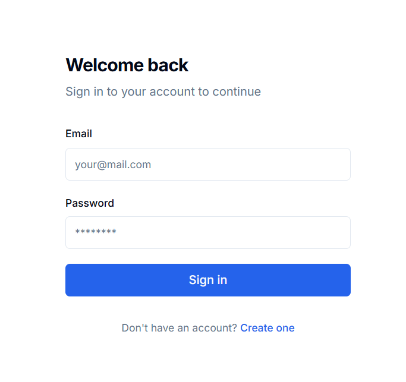

# 📅 Booking Calendar

> A beautifully crafted, full-stack booking calendar with custom month/week/day views, real-time navigation, and dark mode — built entirely without FullCalendar.

[](https://vitejs.dev)
[](https://react.dev)
[](https://www.typescriptlang.org)
[](https://tailwindcss.com)
[](https://expressjs.com)
[](https://www.prisma.io)
[](https://www.postgresql.org)
[](https://tanstack.com/query)
[](https://zustand-demo.pmnd.rs)
[](https://www.framer.com/motion)

[](https://bookingcalender-rho.vercel.app)
[](https://booking-calender-oyh7.onrender.com/api/health)

---

## The Story

Most calendar projects reach for FullCalendar. It's the obvious choice — it works, it's battle-tested, and it saves time. But there's a catch: you inherit someone else's decisions about how things should look, feel, and behave.

I wanted more.

I wanted a calendar that feels like a native app. Smooth view transitions with Framer Motion. A red current-time line that glows as the minutes pass. Event cards that pop on hover. A sidebar that slides in with a mini calendar and upcoming events. Dark mode that actually looks good. Glass-morphism that doesn't sacrifice readability.

So I built one from scratch.

**Booking Calendar** is a custom calendar engine — month, week, and day views — powered by modern React, TypeScript, and a clean Express API. Every pixel, every animation, every interaction was made by hand, learned from, and refined.

No FullCalendar. No shortcuts. Just intentional design.

---

## Screenshots

| Landing Page | Month View | Week View |
|---|---|---|
|  |  |  |

| Day View | Dark Mode | Login Page |
|---|---|---|
|  |  |  |

---

## Features

### Calendar Views
| View | Highlights |
|---|---|
| **Month View** | CSS Grid layout, event count badges, today highlight, hover effects, click-to-create |
| **Week View** | 7-column hourly timeline, sticky headers, **red current-time line** with glow, event positioning by start/end |
| **Day View** | Single-column timeline, all-day section, current-time indicator, "Click to add" placeholders |

### User Experience
- **Dark / Light mode** — persisted, instant toggle, carefully tuned colors
- **Search & filter** — by title, description, or location
- **Sidebar** — mini calendar for quick navigation + top 5 upcoming events
- **Framer Motion** — view transitions, sidebar slide-in, hover animations
- **Responsive** — sidebar hides on mobile, adapts to any screen

### Event Management
- **Create / Edit / Delete** — modal form with react-hook-form + Zod validation
- **Color picker** — assign colors to events for visual grouping
- **All-day toggle** — distinguish timed events from full-day events
- **Recurring schema** — RRULE support baked into the data model (UI ready for expansion)

### Authentication
- **JWT-based** — register, login, protected routes
- **Split-layout pages** — gradient branding panel + animated form
- **Zod validation** — same validation on both client and server

---

## Tech Stack

### Frontend
| Technology | Purpose |
|---|---|
| **React 19** | UI framework with modern hooks and concurrent features |
| **TypeScript** | Type safety across the entire codebase |
| **Vite** | Lightning-fast dev server and builds |
| **Tailwind CSS v3** | Utility-first styling with CSS variable theming |
| **shadcn/ui** | Accessible Radix primitives styled with Tailwind |
| **Framer Motion** | Animations — view transitions, modals, sidebar |
| **TanStack Query** | Server state management, caching, mutations |
| **Zustand** | Lightweight client state (auth, UI preferences) |
| **date-fns** | Date manipulation and formatting |
| **react-hook-form** | Performant form handling with Zod resolvers |
| **Radix UI** | Accessible dialog, dropdown, popover, select, switch primitives |

### Backend
| Technology | Purpose |
|---|---|
| **Express 4** | HTTP server and routing |
| **TypeScript** | Type safety with tsx runtime |
| **Prisma** | ORM with migrations and type-safe queries |
| **PostgreSQL (Neon)** | Serverless Postgres with IPv4 support |
| **Zod** | Request validation schemas |
| **bcryptjs** | Password hashing |
| **jsonwebtoken** | JWT sign/verify |

### DevOps
| Service | Purpose |
|---|---|
| **Vercel** | Frontend hosting (SPA, auto-deploy from GitHub) |
| **Render** | Backend hosting (free tier, cold-starts after inactivity) |
| **Neon** | Database hosting (7-day backup retention) |
| **cron-job.org** | Keep-alive pings to prevent Render spin-down |

---

## Quick Start

### Prerequisites
- Node.js 18+
- PostgreSQL (local or Neon remote)

### Clone & Install
```bash
git clone https://github.com/Olumidedara/booking-calender.git
cd booking-calender
npm run install:all
```

### Server Setup
```bash
cd server
cp .env.example .env
```

Edit `.env` with your `DATABASE_URL` (PostgreSQL connection string) and a `JWT_SECRET`.

```bash
npm run db:migrate   # Run Prisma migrations
npm run db:seed      # Seed demo user + sample events
npm run dev          # Start dev server at http://localhost:3001
```

### Client Setup
```bash
cd client
cp .env.example .env
npm run dev          # Start dev server at http://localhost:5173
```

### Or run both at once (from root)
```bash
npm run dev
```

---

## Live Demo

| Link | URL |
|---|---|
| **Frontend** | [https://bookingcalender-rho.vercel.app](https://bookingcalender-rho.vercel.app) |
| **Backend API** | [https://booking-calender-oyh7.onrender.com/api/health](https://booking-calender-oyh7.onrender.com/api/health) |
| **GitHub** | [https://github.com/Olumidedara/booking-calender](https://github.com/Olumidedara/booking-calender) |


---

## Deployment

### Frontend (Vercel)
- Auto-deploys from the `master` branch
- SPA rewrite configured via `vercel.json`
- Environment variable: `VITE_API_URL` pointing to the Render backend

### Backend (Render)
- Web service using `npx tsx src/index.ts` as start command
- `tsx` and `prisma` in production dependencies (Render free tier skips `devDependencies`)
- Environment variables: `DATABASE_URL`, `JWT_SECRET`, `CLIENT_URL`
- Database migrations run manually via `npm run db:migrate`

### Database (Neon)
- Serverless PostgreSQL, free tier with 500 MB storage
- Supports IPv4 (unlike Supabase, which is IPv6-only — important for Render connectivity)

---

## Project Structure

```
booking-calendar/
├── client/                     # React frontend (Vite)
│   ├── src/
│   │   ├── components/
│   │   │   ├── calendar/       # MonthView, WeekView, DayView, EventCard
│   │   │   ├── events/         # EventModal
│   │   │   └── ui/             # shadcn primitives (Button, Dialog, etc.)
│   │   ├── hooks/              # useCalendar, useEvents
│   │   ├── pages/              # CalendarPage, LoginPage, RegisterPage
│   │   ├── services/           # API client with JWT management
│   │   ├── stores/             # Zustand stores (auth, ui)
│   │   └── types/              # Shared TypeScript types
│   └── ...
├── server/                     # Express backend
│   ├── src/
│   │   ├── routes/             # auth.ts, events.ts
│   │   ├── middleware/         # JWT auth, error handler
│   │   ├── schemas/            # Zod validation schemas
│   │   └── lib/                # Prisma client singleton
│   ├── prisma/
│   │   ├── schema.prisma       # Database schema
│   │   └── seed.ts             # Demo data seeder
│   └── ...
└── README.md                   # You are here
```

---

## What I Learned

Building a calendar from scratch taught me more than any library ever could:

- **Layout algorithms** — positioning events on a timeline without overlap requires careful math
- **Date arithmetic** — `date-fns` becomes your best friend when calculating week boundaries, month grids, and time slots
- **Current-time line** — rendering a line that stays in sync with the clock, scrolls into view, and only appears on "today" is surprisingly nuanced
- **Performance** — filtering hundreds of events across views with memoization and stable keys
- **Dark mode theming** — CSS variables make it seamless, but every color needs to pass contrast checks in both modes
- **Accessibility** — Radix primitives handle focus management and keyboard navigation, but custom views need manual attention

---

## License

MIT

---

*Built with ☕ and late nights by [Olumide](https://github.com/Olumidedara)*
